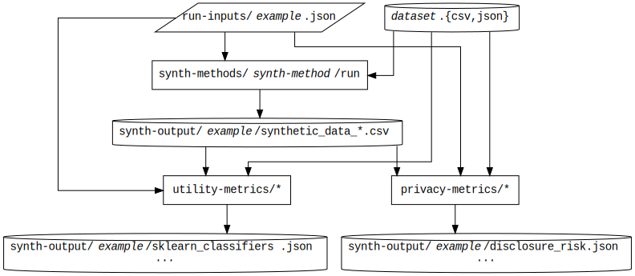

[](https://mybinder.org/v2/gh/alan-turing-institute/QUIPP-pipeline/develop)

# QUIPP-pipeline
Privacy-preserving synthetic data generation workflows

_Collaboration and project management is in the
[QUIPP-collab](https://github.com/alan-turing-institute/QUIPP-collab)
repo._

**Please do not open new issues in this repository: Instead, [open a new issue in QUIPP-collab](https://github.com/alan-turing-institute/QUIPP-collab/issues/new) and add the 'pipeline' label.**

The QUiPP (Quantifying Utility and Preserving Privacy) project aims to
produce a framework to facilitate the creation of synthetic population
data where the privacy of individuals is quantified. In addition,
QUiPP can assess utility in a variety of contexts.  Does a model
trained on the synthetic data generalize as well to the population as
the same model trained on the confidential sample, for example?

The proliferation of individual-level data sets has opened up new
research opportunities.  This individual information is tightly
restricted in many contexts: in health and census records, for example.
This creates difficulties in working openly and reproducibly, since
full analyses cannot then be shared.  Methods exist for creating
synthetic populations that are representative of the existing
relationships and attributes in the original data.  However,
understanding the utility of the synthetic data and simultaneously
protecting individuals' privacy, such that these data can be released
more openly, is challenging.

This repository contains a pipeline for synthetic population
generation, using a variety of methods as implemented by several
libraries.  In addition, the pipeline emits measures of privacy and
utility of the resulting data.

## Installation
- Clone the repository `git clone
  git@github.com:alan-turing-institute/QUIPP-pipeline.git`

## Dependencies

_Note that a Docker image is provided with the dependencies
pre-installed, as
[turinginst/quipp-env](https://hub.docker.com/repository/docker/turinginst/quipp-env).
More detail on setting this up can be found
[here](env-configuration/README.md)._

- Various parts of this code and its dependencies are written in
  Python, R, C++ and Bash.
- It has been tested with
  - python 3.6
  - R 3.6
  - gcc 9.3
  - bash 3.2
- It depends on the following libraries/tools:
  - Python: [numpy](https://pypi.org/project/numpy/), [pandas](https://pypi.org/project/pandas/), [scikit-learn](https://pypi.org/project/scikit-learn/), [scipy](https://pypi.org/project/scipy/), [ctgan](https://pypi.org/project/ctgan/), [SDV](https://pypi.org/project/sdv/), [simanneal](https://pypi.org/project/simanneal/)
  - R: [simPop](https://CRAN.R-project.org/package=simPop), [synthpop](https://CRAN.R-project.org/package=synthpop), [mice](https://CRAN.R-project.org/package=mice), [dplyr](https://CRAN.R-project.org/package=dplyr), [magrittr](https://CRAN.R-project.org/package=magrittr), [tidyr](https://CRAN.R-project.org/package=tidyr)
  - [SGF](https://vbinds.ch/node/69) (Synthetic Data Generation Framework)

### Installing the dependencies

#### R and Python dependencies

To install all of the python and R dependencies, run the following
commands in a terminal from the root of this repository:

```bash
python -m pip install -r env-configuration/requirements.txt
```

```
R
> source("env-configuration/install.R")
> q()
```

#### SGF

Another external dependency is the SGF implementation of plausible
deniability:
  
 - Download SGF [here](https://vbinds.ch/node/69)
 - See the library's README file for how to compile the code.  You will
need a recent version of cmake (tested with version 3.17), either
installed through your system's package manager, or from
[here](https://cmake.org/download/).
 - After compilation, the three executables of the SGF package
(`sgfinit`, `sgfgen` and `sgfextract`) should have been built.  Add
their location to your PATH, or alternatively, assign the
environmental variable `SGFROOT` to point to this location.  That is, in bash,
   - either ```export PATH=$PATH:/path/to/sgf/bin```,
   - or ```export SGFROOT=/path/to/sgf/bin```

#### Forked DataSynthesizer

We use the PrivBayes implementation within the DataSynthesizer fork found [here](https://github.com/gmingas/DataSynthesizer). 
In order to install it, clone the above repository locally, go to its root directory and run `pip install .`

## Top-level directory contents

The top-level directory structure mirrors the data pipeline.

 - [`doc`](doc): The QUiPP report - a high-level overview of the project, our
   work and the methods we have considered so far.

 - [`examples`](examples): Tutorial examples of using some of the methods
   (_currently just CTGAN_).  These are independent of the pipeline.

 - [`binder`](binder): Configuration files to set up the pipeline using
   [Binder](https://mybinder.org)
 
 - [`env-configuration`](env-configuration): Set-up of the computational environment needed
   by the pipeline and its dependencies
 
 - [`generators`](generators): Quickly generating input data for the pipeline from a
   few tunable and well-understood models

 - [`datasets`](datasets): Sample data that can be consumed by the pipeline.

 - [`datasets-raw`](datasets-raw): A few (public, open) datasets that
   we have used are reproduced here where licence and size permit.
   They are not necessarily of the correct format to be consumed by
   the pipeline.

 - [`synth-methods`](synth-methods): One directory per library/tool, each of them
   implementing a complete synthesis method

 - [`utility-metrics`](utility-metrics): Scripts relating to computing the utility
   metrics
 
 - [`privacy-metrics`](privacy-metrics): Scripts relating to computing the privacy
   metrics

 - [`run-inputs`](run-inputs): Parameter json files (see below), one for each run

When the pipeline is run, additional directories are created:

 - `generator-outputs`: Sample generated input data (using
   [`generators`](generators/))
   
 - `synth-output`: Contains the result of each run (as specified in
   [`run-inputs`](run-inputs/)), which will typically consist of the synthetic data
   itself and a selection of utility and privacy scores

## The pipeline

The following indicates the full pipeline, as run on an input file
called `example.json`.  This input file has keywords `dataset` (the
base of the filename to use for the original input data) and
`synth-method` which refers to one of the synthesis methods.  As
output, the pipeline produces:
 - synthetic data, in one or more files `synthetic_data_1.csv`, `synthetic_data_2.csv`, ...
 - the disclosure risk privacy score, in `disclosure_risk.json`
 - classification scores of utility, `sklearn_classifiers.json`



The files `dataset.csv` and `dataset.json` could be in a subdirectory of
[datasets](datasets/), but this is not a requirement.

## Running the pipeline

1. Make a parameter json file, in [`run-inputs/`](run-inputs/), for each desired
   synthesis (see below for the structure of these files).

2. Run `make` in the top level QUIPP-pipeline directory to run all
   syntheses (one per file).  The output for `run-inputs/example.json`
   can be found in `synth-output/example/`.  It will consist of:
   - one or more syntehtic data sets, based on the orignal data (as
     specified in `example.json`), called `synthetic_data_1.csv`,
     `synthetic_data_2.csv`, ...
   - the file `disclosure_risk.json`, containing the
     disclosure risk scores
   - the file `sklearn_classifiers.json`, containing the
     classification scores

3. `make clean` removes all synthetic output and generated data.


## Adding another synthesis method

1. Make a subdirectory in [`synth-methods`](synth-methods) having the name of the new
   method.

2. This directory should contain an executable file `run` that when
   called as

   ```bash
   run $input_json $dataset_base $outfile_prefix
   ```

   runs the method with the input parameter json file on the dataset
   `$dataset_base.{csv,json}` (see data format, below), and puts its
   output files in the directory `$outfile_prefix`.

3. In the parameter JSON file (a JSON file in [`run-inputs`](run-inputs)), the method can
   be used as the value of the `"synth-method"` name.


## Data file format

The input data should be present as two files with the same prefix: a
[csv](https://tools.ietf.org/html/rfc4180.html) file (with suffix
`.csv`) which must contain column headings (along with the column data
itself), and a [json file](doc/schema/) (the "data json file")
describing the types of the columns used for synthesis.

For example, see [the Polish Social Diagnosis dataset](datasets/polish_data_2011/).
This contains the files

 - `datasets/polish_data_2011/polish_data_2011.csv`
 - `datasets/polish_data_2011/polish_data_2011.json` 
 
and so has the prefix `datasets/polish_data_2011/polish_data_2011`
relative to the root of this repository.

The prefix of the data files (as an absolute path, or relative to the
root of the repository) is given in the parameter json file (see the
next section) as the top-level property `dataset`: there is no
restriction on where these can be located, although a few examples can
be found in [`datasets/`](datasets/).

## Parameter file format

The pipeline takes a single json file, describing the data synthesis
to perform, including any parameters the synthesis method might need,
as well as any additional parameters for the privacy and utlity
methods.  The json schema for this parameter file is [here](doc/schema/).

**To be usable by the pipeline, the parameter input file must be
located in the `run-inputs` directory**

### Example

The following example is in [`run-inputs/synthpop-example-2.json`](run-inputs/synthpop-example-2.json).

```json
{
    "enabled" : true,
    "dataset" : "generator-outputs/odi-nhs-ae/hospital_ae_data_deidentify",
    "synth-method" : "synthpop",
    "parameters": 
    {
        "enabled" : true,
        "num_samples_to_fit": -1,
        "num_samples_to_synthesize": -1,
        "num_datasets_to_synthesize": 5,
        "random_state": 12345,
        "vars_sequence": [5, 3, 8, 1],
        "synthesis_methods": ["cart", "", "cart", "", "cart", "", "", "cart"],
        "proper": true,
        "tree_minbucket": 1,
        "smoothing": {}
    },
    "parameters_disclosure_risk":
    {
        "enabled": true,
        "num_samples_intruder": 100,
        "vars_intruder": ["Treatment", "Gender", "Age bracket"]
    },
    "parameters_sklearn_utility":
    {
        "enabled": true,
        "input_columns": ["Time in A&E (mins)"],
        "label_column": "Age bracket",
        "test_train_ratio": 0.2,
        "num_leaked_rows": 0
    }
}
```

### Schema

The JSON schema for the parameter json file is [here](doc/schema/parameters.schema.json).

#### Description

The parameter JSON file must include the following names:

- `enabled` (_boolean_): Run this example?
- `dataset` (_string_): The prefix of the dataset (.csv and .json are
  appended to get the paths of the data files)
- `synth-method` (_string_): The synthesis method used by the run.
  It must correspond to a subdirectory of [`synth-methods`](synth-methods/).
- `parameters` (_object_): The parameters passed to the synthesis
  method.  The contents of this object will depend on the
  `synth-method` used: the contents of this object are documented
  separately for each.  The following names are common across each method:
  - `enabled` (_boolean_): Perform the synthesis step?
  - `num_samples_to_fit` (_integer_): How many samples from the input dataset should be
    used as input to the synthesis procedure?  To use all of the input records, pass a 
    value of `-1`.
  - `num_samples_to_synthesize` (_integer_): How many synthetic samples should be
    produced as output?  To produce the same number of output records as input records,
    pass a value of `-1`.
  - `num_datasets_to_synthesize` (_integer_): How many entire synthetic datasets should
    be produced?
  - `random_seed` (_integer_): the seed for the random number generator (most methods
    require a PRNG: the seed can be explicitly passed to aid with the testability and
    reproducibility of the synthetic output)
  - Additional options for [CTGAN](synth-methods/CTGAN/README.md#additional-synthesis-parameters),
    [SGF](synth-methods/sgf/README.md#additional-synthesis-parameters) and
    [synthpop](synth-methods/synthpop/README.md#additional-synthesis-parameters)
- `parameters_disclosure_risk` (_object_): parameters needed to
  compute the disclosure risk privacy score
  - `enabled` (_boolean_): compute this score?
  - `num_samples_intruder` (_integer_): how many records
    corresponding to the original dataset exist in a dataset visible
    to an attacker.
  - `vars_intruder` (_array_):
    - items (_string_): names of the columns that are available in
      the attacker-visible dataset.
- `parameters_sklearn_utility` (_object_): parameters needed to
  compute the classification utility scores with scikit learn:
  - `enabled` (_boolean_): compute this score?
  - `input_columns` (_array_):
    - items (_string_): names of the columns to use as the
      explanatory variables for the classification
  - `label_column` (_string_): the column to use for the category
     labels
  - `test_train_ratio` (_number_): fraction of records to use in
    the test set for the classification
  - `num_leaked_rows` (_integer_): the number of additional records
    from the original dataset with which to augment the synthetic
    data set before training the classifiers. This is primarily an
    option to enable testing of the utility metric (i.e. the more
    rows we leak, the better the utility should become). It should
    be set to 0 during normal synthesis tasks.
